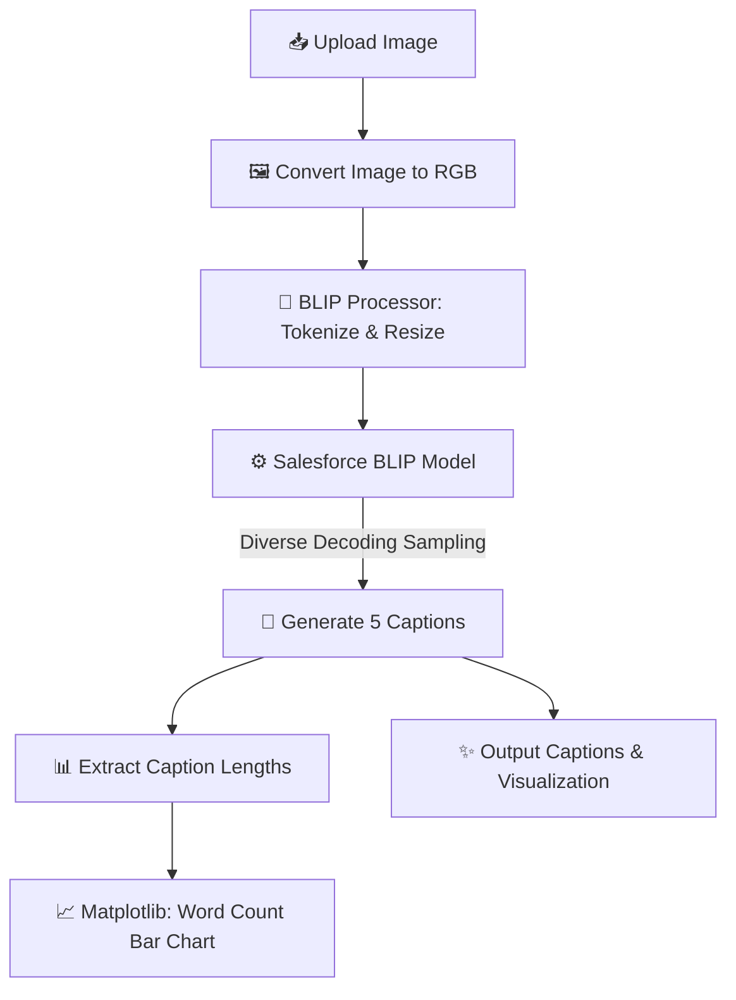

# 📸 Image Caption Generator using BLIP

An end-to-end deep learning pipeline that generates diverse, descriptive, and high-quality captions for any input image. This project leverages Salesforce's state-of-the-art **BLIP (Bootstrapped Language-Image Pretraining)** model via Hugging Face Transformers.

---

<p align="center">
  <a href="https://colab.research.google.com/github/prasathr0811/Image-caption-generator/blob/main/Image_Captioning.ipynb">
    
  </a>
  &nbsp;
  
  &nbsp;
  
  &nbsp;
  
  &nbsp;
  
</p>

---

## 🌟 Key Features

*   **Diverse Caption Generation:** Generates up to **5 distinct, natural-language captions** per image using advanced temperature and top-$p$/top-$k$ sampling techniques.
*   **State-of-the-Art Vision-Language Model:** Powered by `Salesforce/blip-image-captioning-base`, pretrained on millions of image-text pairs.
*   **Interactive Interface:** Seamless image uploading and displaying directly within Jupyter / Google Colab notebooks.
*   **Caption Analysis & Visualization:** Generates a real-time bar chart comparing caption lengths (word counts) using `matplotlib`.
*   **Hardware Acceleration:** Automatically detects and utilizes GPU (`cuda`) for lightning-fast inference, falling back to CPU when necessary.

---

## ⚙️ How It Works (Pipeline Workflow)

The project processes the input image through a deep learning encoder-decoder pipeline to produce captions and analysis:



---

## 📂 Project Directory Structure

```text
Image-caption-generator/
│
├── Image_Captioning.ipynb   # Main Google Colab Jupyter Notebook containing source code
├── README.md                # Project documentation and guide
└── .gitignore               # Ignored local files and cache
```

---

## 🚀 Quick Start & Usage

### Option 1: Google Colab (Recommended)

Since the project uses notebook-specific utilities (like `google.colab.files`), the easiest way to run it is on Google Colab with GPU acceleration:

1.  Click the **Open in Colab** badge at the top of this README.
2.  Go to **Runtime > Change runtime type** and select **GPU (T4)** for fast processing.
3.  Run all cells (`Ctrl + F9`).
4.  When prompted, upload any image (`.jpg`, `.png`, `.jpeg`), and see the generated captions and lengths plot.

---

### Option 2: Running Locally

To run this pipeline locally, follow these steps:

#### 1. Clone the Repository
```bash
git clone https://github.com/prasathr0811/Image-caption-generator.git
cd Image-caption-generator
```

#### 2. Set Up a Virtual Environment (Optional but Recommended)
```bash
python -m venv venv
# On Windows:
venv\Scripts\activate
# On macOS/Linux:
source venv/bin/activate
```

#### 3. Install Dependencies
```bash
pip install torch torchvision transformers accelerate matplotlib scikit-learn Pillow
```

#### 4. Run the Code
Since `google.colab.files` is only available in Colab, you will need to replace the upload logic in a local Python script (e.g. `main.py`):
```python
from PIL import Image
from transformers import BlipProcessor, BlipForConditionalGeneration
import matplotlib.pyplot as plt
import torch

# Load processor and model
device = "cuda" if torch.cuda.is_available() else "cpu"
processor = BlipProcessor.from_pretrained("Salesforce/blip-image-captioning-base")
model = BlipForConditionalGeneration.from_pretrained("Salesforce/blip-image-captioning-base").to(device)

# Load your local image
image_path = "path/to/your/image.jpg"  # <-- Replace with your image file path
image = Image.open(image_path).convert('RGB')

# Process & Generate Captions
inputs = processor(images=image, return_tensors="pt").to(device)
for i in range(5):
    output = model.generate(
        **inputs,
        max_length=40,
        do_sample=True,
        top_k=50,
        top_p=0.9,
        temperature=1.0,
        repetition_penalty=1.2
    )
    caption = processor.decode(output[0], skip_special_tokens=True)
    print(f"🔹 Caption {i+1}: {caption}")
```

---

## 📊 Sample Output Preview

Given an uploaded image of a forest or natural trail, the model produces diverse descriptions to capture different semantic elements:

| Input Preview | Generated Diverse Captions | Length Plot |
| :---: | :--- | :---: |
| 🪵 *Uploaded Image* | 1️⃣ "A group of people walking through a forest"<br>2️⃣ "Hikers exploring a scenic trail"<br>3️⃣ "A family enjoying nature in the woods"<br>4️⃣ "A path through trees on a sunny afternoon"<br>5️⃣ "People trekking through a green jungle" | 📊 *Word Count Bar Chart* |

---

## 🧠 Model Specifications

*   **Base Model:** `Salesforce/blip-image-captioning-base` (available on [Hugging Face Hub](https://huggingface.co/Salesforce/blip-image-captioning-base))
*   **Architecture:** Vision-Language Pre-training (VLP) with a multimodal encoder-decoder framework.
*   **Decoding Configuration:**
    *   `do_sample=True` enables stochastic generation.
    *   `top_p=0.9` and `top_k=50` filters out low-probability words.
    *   `repetition_penalty=1.2` penalizes repetitive n-grams for richer captions.

---

## 💡 Future Enhancements

- [ ] **Semantic Similarity:** Add cosine similarity scoring between generated captions to measure diversity.
- [ ] **Advanced Models:** Upgrade backend to BLIP-2 or LLaVA for more descriptive, detailed, and context-aware responses.
- [ ] **Web Deployment:** Build an interactive frontend using Streamlit or Gradio for web-based usage.
- [ ] **Quantitative Evaluation:** Integrate BLEU, ROUGE, and CIDEr metrics to evaluate caption quality.

---

## 📄 License

This repository is licensed under the [MIT License](LICENSE). Feel free to fork and build upon it!
